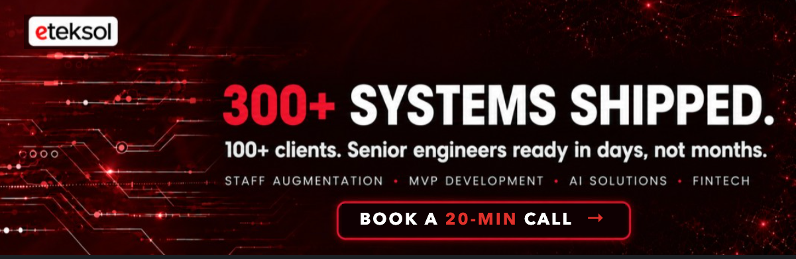

## Eteksol

**Senior .NET, Python and AI engineers who join US product teams in days.**

We build AI products and MVPs for US companies, and we place senior engineers inside teams that are short on capacity. Our engineers work in your Slack, your Jira and your standups, with 4+ hours of overlap with US Eastern time.

### What teams hire us for

| | |
|---|---|
| **AI agents and workflow automation** | LLM features taken from prototype to production: RAG, document summarisation, scoring engines, agentic workflows |
| **MVPs in 6 to 8 weeks** | A funded idea in front of real users, with a codebase you can hire onto later |
| **.NET modernization** | .NET Framework / WebForms / Xamarin moved to .NET 8, MAUI and Azure without switching the business off |
| **Staff augmentation** | A senior .NET, Python, React, Angular or Node.js engineer in your standup within a week |

### Recent work

- **AI case-summary engine** for social work agencies: documentation time down 90%, supervisor decisions 83% faster, 20% more cases with no new hires.
- **AI recruitment engine**: real-time resume scoring, multi-platform sourcing and Twilio outreach. Time to shortlist went from 5 days to 6 hours.
- **Automotive marketplace**: NopCommerce + ASP.NET Core, 500K+ SKUs, year/make/model search.
- **Xamarin.Forms to .NET MAUI** migrations for apps that were already in production.

### Open-source samples

The repos below are sanitised samples and case studies from client work. No client code or data.

| Repo | What it shows |
|---|---|
| [automotive-ecommerce-platform](https://github.com/asif37/automotive-ecommerce-platform) | High-SKU catalogue, fitment search, NopCommerce plugins |
| [xamarin-to-maui-migration](https://github.com/asif37/xamarin-to-maui-migration) | Step-by-step Xamarin.Forms to .NET MAUI migration |
| [realtime-rate-display](https://github.com/asif37/realtime-rate-display) | Live loan-rate updates pushed to screens in real time |
| [realtime-chat-service](https://github.com/asif37/realtime-chat-service) | ASP.NET Core, SignalR and Redis backplane chat |
| [experience-marketplace-mvp](https://github.com/asif37/experience-marketplace-mvp) | Two-sided marketplace MVP |
| [remittance-web-app](https://github.com/asif37/remittance-web-app) | Money-transfer web front end in TypeScript |

### Stack

`C#` `.NET 8` `ASP.NET Core` `Azure` `Python` `Semantic Kernel` `LangChain` `Azure OpenAI` `Claude` `Azure AI Search` `SQL Server` `PostgreSQL` `Redis` `Angular` `React` `Node.js` `.NET MAUI`

### How an engagement starts

1. **20-minute call.** You describe the product or the gap in the team.
2. **Straight answer within 24 hours** on scope, team shape and timeline.
3. **Working software every week** from the first sprint. If something slips, you hear it from us first.

### Track record

300+ systems shipped since 2012. Led by founder Asif Hameed: 18 years of .NET delivery, 27,000+ billed hours and a 100% client success score.

**[Book a 20-minute call](https://calendly.com/asifhameed/meeting)** · [eteksol.com](https://eteksol.com) · [LinkedIn](https://www.linkedin.com/company/eteksol)
